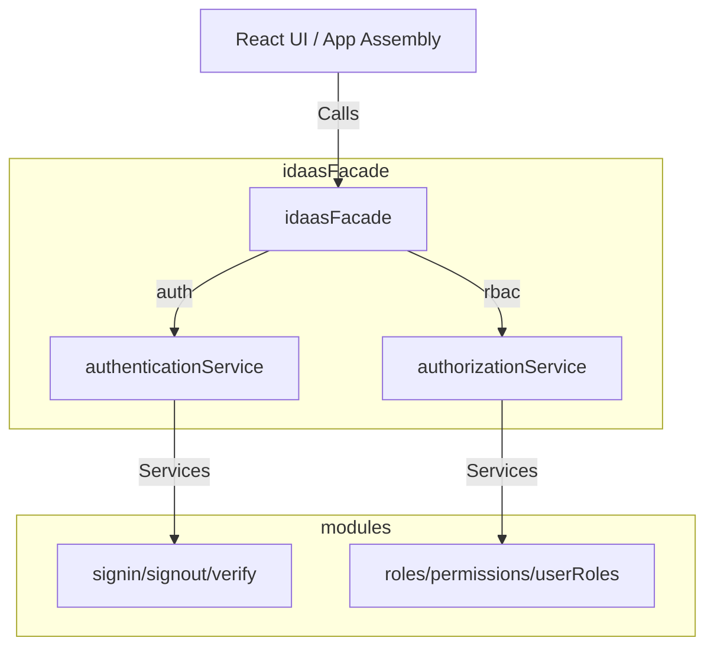

# Component Deep Dive — Domain Kernel & IDaaS Facade

## 1. Domain Kernel Architecture

The `@cap/module-auth` package features a structured domain layer located at `packages/modules/auth/src/domain-kernel`. It enforces clean boundaries and Domain-Driven Design (DDD) principles by separating domain core models/ports from implementation adapters.

### Event Bus Architecture (`domain-kernel/src/events`)

The event bus provides an asynchronous messaging infrastructure within the client application shell to decouple authentication-related actions from authorization/logging reactions.

*   **`event-bus.ts`**: Defines the `EventBus` class and `DomainEvent<T>` interface.
    *   **Wildcard Subscriptions**: Handlers can subscribe to specific events (e.g., `UserAuthenticated:v1`) or wildcard event streams using `${eventType}:*`.
    *   **Asynchronous Handler Execution**: Uses `Promise.resolve(handler(event))` inside a `Promise.all` mapping. While handlers run concurrently and errors are caught on a per-handler basis, publishing blocks until all handlers resolve (or reject).
    *   **Tracing Metadata**: Events include `correlationId` and `causationId` support to track transactional flows.
*   **`auth-events.ts`**: Contains types and interfaces for authentication, session, and token lifecycles:
    *   `AuthEventTypes`: `UserAuthenticated`, `AuthenticationFailed`, `MfaChallengeIssued`, `MfaVerified`, `AccountLocked`
    *   `SessionEventTypes`: `SessionCreated`, `SessionExpired`, `SessionRevoked`
    *   `TokenEventTypes`: `TokenIssued`, `TokenRevoked`, `TokenRefreshed`
*   **`event-factory.ts`**: Exports builder functions (e.g., `createUserAuthenticatedEvent`) that generate `DomainEvent` objects with auto-generated UUIDs and ISO timestamps.

### Domain Ports (`domain-kernel/src/ports`)

Ports define the contracts that must be implemented by downstream adapters. They partition the authentication/authorization space cleanly:

1.  **Authentication (`ports/authentication.ts`)**:
    *   `IAuthenticateUser`: Basic credential checks.
    *   `IVerifyMfa`: Multi-factor code validation.
    *   `IMfaOrchestrator`: Strategies for credential enrollment, list, and removal.
    *   `IPasswordless`: Magic links and WebAuthn (Passkey) registration/authentication flows.
    *   `ISessionManager`: Retrieval and revocation of user sessions.
2.  **Authorization (`ports/authorization.ts`)**:
    *   `IPermissionChecker`: Checks single permission queries or evaluates access against active contexts.
    *   `IRoleManager` & `IPermissionManager`: CRUD management of roles, permission definitions, and mapping connections.
    *   `IPolicyEngine`: Policy evaluation mechanisms.
    *   `IMemberOverrideManager`: User-specific organization override rules.
3.  **User Directory (`ports/user.ts`)**:
    *   `IUserRepository` & `IUserProfileRepository`: Core profile accessors.
    *   `IOrganizationRepository`, `IOrganizationMemberRepository`, and `IOrganizationInvitationRepository`: Multi-tenancy and organization membership lifecycle.

---

## 2. IDaaS Facade (`idaas-facade/src/index.ts`)

The IDaaS (Identity-as-a-Service) Facade wraps the underlying implementation modules (`authentication-core` services and `authorization-engine` services) into a unified api interface `IIdaasFacade`.

### Methods Exposed

*   **`auth` namespace**:
    *   `login`, `logout`, `refreshToken`, `forgotPassword`, `resetPassword`, `verifyEmail`, and `resendVerification`.
*   **`rbac` namespace**:
    *   Role CRUD operations (`listRoles`, `getRole`, `createRole`, `updateRole`, `deleteRole`), permissions discovery (`listPermissions`, `getRolePermissions`, `syncRolePermissions`), user assignments (`assignRoleToUser`, `getUserRoles`), and authorization evaluation (`checkPermission`).

---

## 3. Structural Gaps & Observations

### The Event Bus (formerly "Orphaned Event Bus" — now RESOLVED)

`EventBus` has full-fledged support for publishing and subscribing:
1.  **Subscriptions exist**: `rbac.subscriber.ts` correctly subscribes to `USER_AUTHENTICATED`, `SESSION_CREATED`, `SESSION_REVOKED`, and `TOKEN_ISSUED` when `subscribe()` is called.
2.  **Publishing is now active**: `eventBus.publish()` calls were injected across the authentication lifecycle in `packages/modules/auth/src/modules/authentication-core/services/auth.service.ts` — `UserAuthenticated`, `SessionCreated`, `TokenIssued`, `SessionRevoked`, `TokenRefreshed`, and `AuthenticationFailed` are all published on their respective state changes (sign-in, sign-up, sign-out, session revocation, refresh, failed logins).
3.  **Impact**: The pub-sub architecture is functional — subscribers such as `RbacSubscriber` now receive lifecycle events in practice, not just in tests.

### Shared Signals and Events (SSF)

The domain-kernel contains structural types for **Shared Signals and Events (SSF)** under `domain-kernel/src/types/ssf.ts`.
*   **Purpose**: SSF is an open security standard (typically OpenID Foundation) allowing different security providers to broadcast security events (e.g., credential changes, session revocations, account lockouts) in real-time.
*   **Implementation**: In `packages/modules/auth/src/modules/authorization-engine/services/adminService.ts`, the admin API fetches and manages SSF via `getSSFConfig`, `updateSSFConfig`, `testSSFStream`, and `broadcastSSFEvent`.
*   **UI integration**: A dedicated configuration panel is located at `SSFConfiguration.tsx` (in the SSO section), allowing administrators to configure the stream, view stream history, and run test broadcasts. This shows a high level of preparedness for federated machine identity and zero-trust event synchronization.
