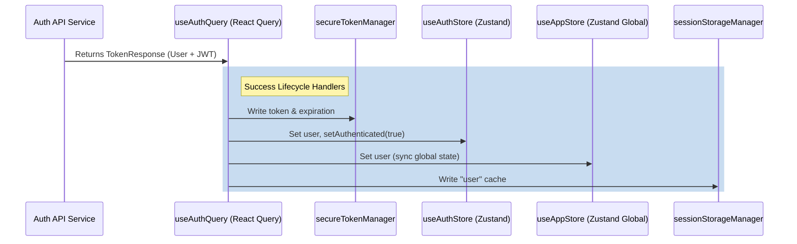

# Component Deep Dive — State & Session Management Hooks

This document reviews the design, state synchronization, and reconnection behaviors of the custom hooks driving the platform's authentication and real-time Server-Sent Events (SSE).

---

## 1. Auth Query Composition (`useAuthQuery.ts`)

The `useAuthQuery.ts` hook acts as a facade combining TanStack React Query (v5) with multiple state managers (Zustand client store, Session Storage, and Secure Token Storage).

### State Synchronization Flow

The hook ensures atomic authentication state updates across various subsystems upon successful sign-in or session loading:



### Role Normalization & Coercion

A critical function in both `useSignin` and `useSession` is user role normalization before state write:
*   **Role Objects**: If the backend returns a complex role object (e.g. `{ id: 2, name: 'Admin' }`), the hook stores the original in `roleObject`, extracts the string name in `roleName`, and normalizes the primary `role` attribute to its numeric ID (`role: role.id`).
*   **String Coercion**: If the role is returned as a numeric string (e.g., `"2"`), it is coerced using `Number(role)` to prevent type mismatches in layout guards.
*   **Rationale**: Ensures robust validation in layout-level route checks (like `useHasRole` or `<AdminRoute />`) which expect strict numeric values (e.g. Roles enum).

### Logout / Teardown Security

Upon invoking `useSignout`, the hook cleanses the client environment:
1.  Clears access tokens via `secureTokenManager.clearTokens()`.
2.  Resets local Zustand auth store (`clearAuth()` and resets step back to `credentials`).
3.  Resets global app store via `useAppStore.getState().signOut()`.
4.  Clears the entire React Query cache: `queryClient.clear()` to prevent data leakage from previous queries.

---

## 2. Server-Sent Events Hook Implementations (`useSSE.ts`)

The platform contains two distinct `useSSE` hooks, each serving separate architecture layers.

### Auth Module Hook (`useSSESubscription` in `@cap/module-auth`)

*   **Location**: `packages/modules/auth/src/modules/authentication-core/hooks/useSSE.ts`
*   **Target Scope**: Modular generic events.
*   **Reconnection Logic**: Implements **exponential backoff** (`initialRetryInterval * Math.pow(2, retryCount)`).
*   **Stability / Ref Safeguards**: To prevent callback modification from triggering unnecessary EventSource tear-down and re-connection, the hook copies `onMessage`, `onError`, and `onOpen` functions into React `useRef` containers:
    ```typescript
    const onMessageRef = useRef(onMessage)
    useEffect(() => {
      onMessageRef.current = onMessage
    }, [onMessage])
    // The EventSource listener executes onMessageRef.current() instead of onMessage
    ```
*   **URL Shift Reset**: If the URL changes mid-lifecycle, the retry count is reset immediately in the render phase to start fresh:
    ```typescript
    if (url !== prevUrl) {
      setPrevUrl(url)
      setRetryCount(0)
    }
    ```

### Platform Core Hook (`useSSE` in `@cap/platform-core`)

*   **Location**: `packages/platform-core/src/services/hooks/useSSE.ts`
*   **Target Scope**: Background asynchronous jobs (e.g., progress tracking for scraping or document analysis).
*   **Reconnection Logic**: Relies on a static interval (`reconnectInterval`, defaults to `5173ms`) up to a fixed maximum limit (`maxReconnectAttempts`, defaults to `5`).
*   **Custom Event Streams**: Instead of subscribing to a default message listener, it actively maps discrete listeners for specific job event types:
    *   `connected`, `progress`, `status_change`, `complete`, `result`, `error`, `heartbeat`
*   **Auto-Close Mechanism**: In its sub-hook wrapper `useScrapingProgress`, it sets up a auto-close timeout:
    ```typescript
    React.useEffect(() => {
      if (isComplete || isFailed || isStopped) {
        const timer = setTimeout(() => { close() }, 2000)
        return () => clearTimeout(timer)
      }
    }, [isComplete, isFailed, isStopped, close])
    ```
    This automatically frees the socket resources 2 seconds after a long-running scraping job completes, avoiding connection leaks.

---

## 3. Comparison Matrix

| Feature | Auth `useSSESubscription` | Platform-Core `useSSE` |
| :--- | :--- | :--- |
| **API URL** | Pure absolute URL | Prepended with `API_CONFIG.baseURL` |
| **Parsing** | Automated JSON parsing | Automated JSON parsing |
| **Event Listeners** | Default `message` and `error` | `connected`, `progress`, `status_change`, `complete`, `result`, `error`, `heartbeat` |
| **Reconnection Strategy** | Exponential backoff (multiplied by power of 2) | Static retry interval |
| **Reconnection Protection** | Callback references stored in refs | Inline callback bindings |
| **Auto-teardown** | Standard component unmount | Auto-teardown 2 seconds post-resolution (scraping) |
