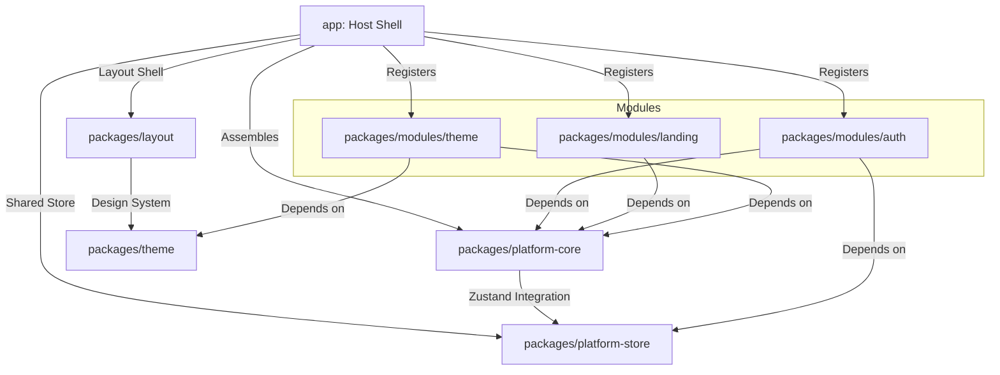

# Comprehensive Codebase Guide

This document provides a technical overview of the architecture, design patterns, and package topology of the civil/digital identity platform boilerplate (`cap-monorepo`).

---

## 1. Monorepo Topology & Package Dependencies

The codebase is organized as a monorepo managed via `pnpm` workspaces. It splits concerns between a central application shell, core shared libraries, UI layout and design systems, and pluggable domain modules.

### Workspace Packages Reference

1.  **`@cap/app` (located in `app/`)**:
    - **Role**: The host shell application. Built using Vite + React 19.
    - **Details**: Sets up the React routing context, global providers (React Query, Theming, locales), and triggers the app assembly by registering the active modules.
2.  **`@cap/platform-core` (located in `packages/platform-core/`)**:
    - **Role**: Infrastructure layer and module orchestrator.
    - **Details**: Provides the `assembleApp` system, HTTP client configurations, core React contexts (tenant services), helper stubs, generic SSE hooks, and the shared i18n dictionary registry.
3.  **`@cap/platform-store` (located in `packages/platform-store/`)**:
    - **Role**: Shared client-state store.
    - **Details**: Powered by Zustand 5 and Immer. Manages user profile status, layouts, notification queues, and settings.
4.  **`@cap/theme` (located in `packages/theme/`)**:
    - **Role**: Visual design system and brand assets.
    - **Details**: Contains MUI 7 overrides, design token dictionaries (color palettes, font scales, z-indexes), tenant theme presets, and CSS-in-JS style configurations.
5.  **`@cap/layout` (located in `packages/layout/`)**:
    - **Role**: UI frame layout and collection components.
    - **Details**: Renders vertical, horizontal, public, and blank layout wraps, handles layout selection logic via the global settings store, manages hydration overlays to avoid UI flickers, and exports high-performance virtualized wrappers (table, list, grid).
6.  **`@cap/module-auth` (located in `packages/modules/auth/`)**:
    - **Role**: Identity & Access Management module.
    - **Details**: Comprehensive DDD package incorporating sign in/up, role authorization controls, Multi-Factor Authentication plugins, session managers, and third-party IDaaS wrappers.
7.  **`@cap/module-landing` (located in `packages/modules/landing/`)**:
    - **Role**: Public-facing landing website.
    - **Details**: Exposes pricing, feature comparisons, and policy information.
8.  **`@cap/module-theme` (located in `packages/modules/theme/`)**:
    - **Role**: Tenant branding module.
    - **Details**: Theme preset picker and the live `ColorPaletteEditor` for the tenant design system, backed by `@cap/theme` and `@cap/platform-core`.

---

## 2. Compile-Time Module Assembly

Rather than using dynamic runtime imports or micro-frontends, the repository implements a compile-time module composition pattern through the `assembleApp` compiler located in `@cap/platform-core/assembly`.

### Registry Synchronization

When the app boots, `assembleApp` processes the collection of registered `CAPModule` descriptors in `app/src/AppAssembly.tsx`:

1.  **i18n Registration**: Loops over the module dictionary configurations and injects them into the global `i18next` engine under both their local translation scope and a shared `common` bundle.
2.  **Navigation Synchronization**: Registers the module's `navItems` array directly into the global Zustand store navigation registry so that layout navigation menus can dynamically build navigation trees.
3.  **Search Indexes**: Iterates over `searchItems` and appends them to a static command-palette index, deduplicating IDs using a `Set` to prevent duplicate actions.
4.  **Route Mapping**: Collects route configurations from the module's `routes` array (`ModuleRegistry.extractRoutesAndNav()`, falling back to the legacy `authRouteConfig` key if `routes` is absent) and flattens them into a unified React Router `<Routes>` component structure, wrapping each element in `LayoutRouteWrapper` so the declared `layout` intent is applied at render time.

---

## 3. Auth Domain & IDaaS Architecture

The auth module (`@cap/module-auth`) follows clean Hexagonal (Ports & Adapters) boundaries to keep security rules decoupled from network protocols and state managers.

### The Hexagonal Flow

- **Ports (`domain-kernel/src/ports/`)**: Defines structural TypeScript interfaces for domain entities. `authentication.ts`, `authorization.ts`, and `user.ts` outline actions like credential validation, MFA challenges, policy evaluation, and organization invitations without assuming a specific database or API provider.
- **Adapters**: Implemented via services like `auth.service.ts` and `authorization.service.ts`. These services translate domain operations into real HTTP client calls targeting the identity server.
- **IDaaS Facade (`idaas-facade/src/index.ts`)**: Consolidates auth and RBAC adapters into a single `idaasFacade` object. UI elements communicate strictly with the facade rather than calling individual services directly, preserving domain boundaries.

### Multi-Factor Authentication Plugins

MFA strategies are decoupled using a strategy plugin registry pattern:

- `MFATOTPPlugin` is initialized via `initAuthPlugins` during boot, hooking into the MFA orchestrator.
- This structure allows future strategies (WebAuthn/Passkeys, SMS, Push notifications) to be registered without modifying the core login flow.

---

## 4. Cross-Cutting Infrastructure Systems

### Multi-Tenancy Theming

The tenant-management system runs on a dynamic provider structure:

1.  `TenantProvider` catches tenant context from the request/subdomain and queries tenant details.
2.  The tenant-specific configuration maps to a custom theme preset inside the `@cap/theme` library.
3.  The theme is loaded dynamically and applied using Emotion's `<ThemeProvider>`, allowing live branding updates.

### Real-Time SSE Streams

Real-time state tracking is supported by two distinct SSE (Server-Sent Events) hook styles:

- **Infrastructure SSE (`@cap/platform-core`)**: Focuses on long-running worker tasks (e.g. document scraping or analysis). It listens to custom events (e.g. `progress`, `complete`) and auto-closes the socket shortly after completion to free client connections.
- **Authentication SSE (`@cap/module-auth`)**: Focuses on session state changes. It employs exponential backoff for reconnection and registers callback listeners inside React refs to prevent un-memoized component updates from triggering reconnection loops.

### Locale Composition

The i18n composition utilizes a deep-merge strategy:

- Locales are imported per feature folder and merged using `registerDictionary`.
- During compilation, a `deepMerge` routine in `platform-core` combines these objects into localized structures (`en`, `fr`, `ar`), maintaining layout directions (LTR vs RTL) based on the current active locale.

---

## 5. Extensibility, Security & Code Quality Standards

To maintain a robust operational boundary as the application scales and integrates with external developer workflows and agentic helpers, developers must adhere to the following core systems:

### Model Context Protocol (MCP) Boundaries

- To enable safe local developer tools or coding assistants (such as browser/IDE shortcuts) to safely query codebase contracts, the workspace recommends wrapping `@cap/api-contracts` and `@cap/auth-contracts` definitions in a locally-hosted Model Context Protocol (MCP) server. This separates documentation and contract schema discovery from live runtime and database services.

### Machine Identity Scopes

- Automated automation tasks, client services, and administrative scripts are managed via Machine Identities (`MachineIdentityManagement.tsx`).
- All generated API Tokens must enforce strict OAuth-style scopes (e.g. `read:contracts`, `write:layout`, `manage:sessions`) rather than running with open user-level credentials.

### Decoupled Reactive State Streams

- Incoming telemetry data, task progress updates, and event payloads (via WebSockets or `useSSE.ts`) must never directly invoke mutation functions in client store slices.
- All real-time streams must publish events to the `EventBus` singleton, letting decoupled module subscribers handle store writes, keeping data flows unidirectional.

### Content Security Policy (CSP)

- The application shell enforces strict CSP rules configured via server headers (and whitelisted in `/app/index.html` fallback metas). Whitelists restrict script runtimes, WebSocket/SSE connection URLs, and static media repositories (such as `/app/public/icons/`).

### Service Worker Caching Hygiene

- The Workbox generator configuration (`/app/dev-dist/sw.js`) is restricted from caching authenticated API responses, JWT elements, or sensitive session variables to prevent token recovery from disk storage on compromised devices.

### Barrel File Encapsulation & Vite Tree-Shaking

- UI components and shared libraries must export their interfaces via central `index.ts` barrel files (e.g., `/packages/layout/src/components/ui/index.ts`).
- Deep imports into component sub-directories are prohibited. This ensures clean encapsulation boundaries and allows Vite/Rollup to perform optimal tree-shaking on unused exports.

### Unified Configuration Boundaries

- Prettier and ESLint rules are consolidated into monorepo root-level setups (e.g. a single unified `eslint.config.js` with sub-project workspace references) to prevent rule drift and format variations between packages.
