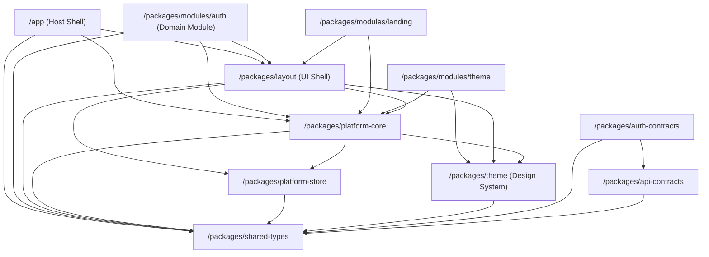
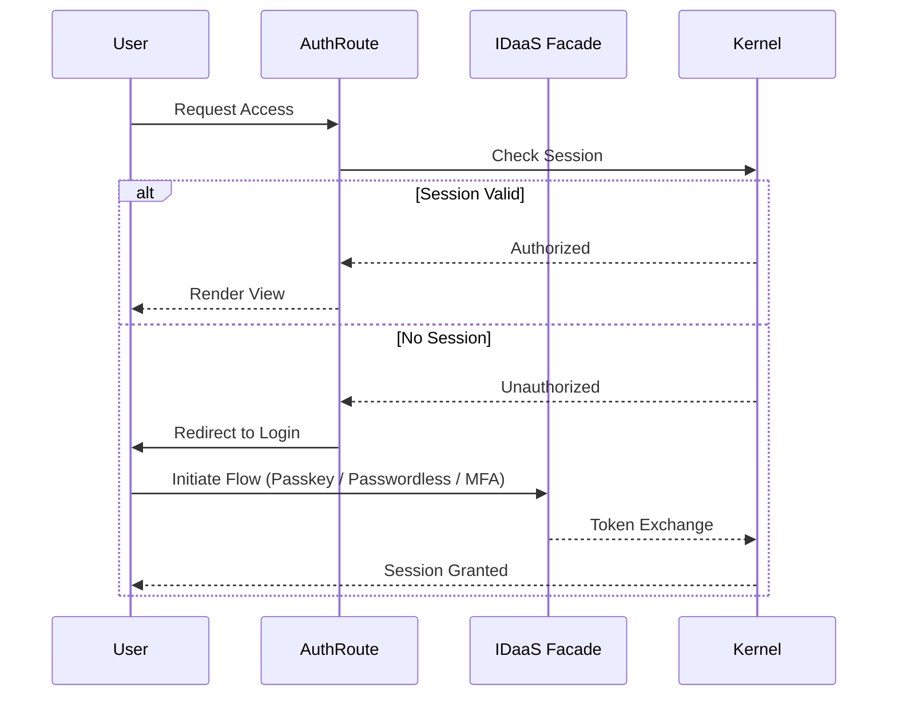

# Developer Onboarding & Architecture Guide

Welcome to the `cap-boilerplate` development team. This document serves as the cohesive architectural onboarding guide, detailing the macro structure of the monorepo, our module boundaries, and deep dives into critical sub-systems.

---

## 1. Architecture Analysis: Monorepo Boundaries

The repository is built around a **Pluggable Module Federation (Compile-Time)** pattern. The host application (`/app`) is a thin shell that orchestrates deeply isolated packages.

### Dependency Graph

> **Note:** Edges above reflect the actual import graph from `docs/MODULE_COUPLING_REPORT.md` (generated 2026-08-04). Notably, `@cap/module-auth` does **not** import `@cap/api-contracts` or `@cap/auth-contracts`, and neither `@cap/api-contracts` nor `@cap/auth-contracts` is imported by any application source today (both have zero afferent coupling) — they are contract-only packages awaiting adoption.

*   **`/app`:** Assembles the React tree, pulling in layout and modules.
*   **`/packages/layout`:** Owns the visual chrome (Sidebar, Headers, Footers). It is decoupled from business logic and simply provides structural wrappers (`VerticalLayout`, `HorizontalLayout`).
*   **`/packages/modules/*`:** Feature-specific verticals. Modules must **never** import from each other directly. They coordinate via shared events in `platform-core`.

---

## 2. Auth Module Deep Dive

The `packages/modules/auth` package is our enterprise-grade Identity and Access Management (IDaaS) module. It follows a Domain-Driven / Hexagonal Architecture.

### Internal Structure

*   **`domain-kernel`:** Contains the pure domain models, ports (abstract interfaces for infrastructure), and domain events (e.g., `UserAuthenticated`, `SessionRevoked`).
*   **`idaas-facade`:** The implementation layer that interfaces with external Identity Providers (or our internal blockchain IDaaS systems).

### Authentication Flows

We support multiple modern authentication strategies via a plugin registry:

*   **Passkey / Device Auth:** Biometric, hardware-backed authentication leveraging WebAuthn.
*   **Passwordless:** Magic links via email, verified through the `idaas-facade`.
*   **MFA (TOTP):** Pluggable Multi-Factor Auth strategies enforced post-primary authentication.

### Authorization Engine

Authorization is handled via explicit boundaries and middleware:
*   **Role Management:** Role-Based Access Control (RBAC) enforced within `AdminRoute` wrappers.
*   **API Token IP Restrictions:** Token minting and validation in the facade include IP binding logic for high-security tenants.
*   **Organization Joining:** Multi-tenant organization contexts isolate user state. Users are authorized contextually per organization.

---

## 3. UI/Layout Deep Dive

The `packages/layout` and `packages/theme` libraries handle our visual presentation.

### Virtualized React Tables

For high-performance data rendering, the layout provides **Virtualized React Tables**:
*   **Usage:** Used in dashboards (e.g., API Explorer) to render thousands of rows without DOM bloat.
*   **Mechanism:** Only visible rows (plus a small overscan buffer) are mounted.
*   **Integration:** Relies on `@tanstack/react-virtual` under the hood, wrapped with our custom theme and pagination controls.

### Theme Wrappers & Multi-Tenancy

Themes are completely dynamic to support multi-tenant white-labeling:
*   **`TenantProvider`:** Exposes a tenant context that dynamically fetches and merges tenant-specific colors and fonts over the base `@cap/theme` tokens.
*   **Material UI (MUI) Integration:** We utilize `ThemeProvider` from MUI to inject these resolved tokens down the React tree.
*   **Theme Switcher:** Allows dynamic toggling and CSS variable injection to avoid expensive re-renders on simple color mode swaps.
