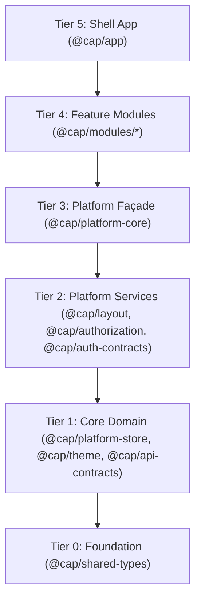

#Serafort — Codebase Functionality Specification

> **Platform:** CAP Multi-Tenant SaaS Modular Platform  
> **Tech Stack:** React 19, TypeScript 5.8, Material-UI v7 (MUI), Zustand 5, Vite 6, TanStack React Query v5, Swapy DnD, TailwindCSS v4, Vitest, Playwright  
> **Package Manager:** `pnpm` Workspaces Monorepo  

---

## Table of Contents

1. [Architectural Overview & Monorepo Tiers](#1-architectural-overview--monorepo-tiers)
2. [Identity & Access Management (@cap/module-auth)](#2-identity--access-management-capmodule-auth)
   - [2.1 Authentication Core](#21-authentication-core)
   - [2.2 MFA & Passkey Orchestration](#22-mfa--passkey-orchestration)
   - [2.3 Passwordless Service](#23-passwordless-service)
   - [2.4 Authorization & Visual Policy Engine](#24-authorization--visual-policy-engine)
   - [2.5 Identity Broker, SSO & SCIM Provisioning](#25-identity-broker-sso--scim-provisioning)
   - [2.6 Session & Account Management](#26-session--account-management)
   - [2.7 User & Organization Directory Governance](#27-user--organization-directory-governance)
   - [2.8 Developer Console & Integrations](#28-developer-console--integrations)
   - [2.9 Platform Cluster & Security Monitoring](#29-platform-cluster--security-monitoring)
3. [Landing & Marketing Module (@cap/module-landing)](#3-landing--marketing-module-capmodule-landing)
4. [Tenant Theme & AI Design Studio (@cap/module-theme)](#4-tenant-theme--ai-design-studio-capmodule-theme)
5. [Dashboard & Swapy Widget Workspace (@cap/module-dashboard)](#5-dashboard--swapy-widget-workspace-capmodule-dashboard)
6. [Agentic AI Widget Studio (@cap/module-widget-studio)](#6-agentic-ai-widget-studio-capmodule-widget-studio)
7. [Platform Core & Modular Assembly (@cap/platform-core)](#7-platform-core--modular-assembly-capplatform-core)
8. [Layout & Navigation Architecture (@cap/layout)](#8-layout--navigation-architecture-caplayout)
9. [ABAC / RBAC Evaluation Engine (@cap/authorization)](#9-abac--rbac-evaluation-engine-capauthorization)
10. [State Management & Encrypted Storage (@cap/platform-store)](#10-state-management--encrypted-storage-capplatform-store)
11. [Design Tokens & UI Component System (@cap/theme)](#11-design-tokens--ui-component-system-captheme)
12. [API Contracts & Query Key Registry (@cap/api-contracts)](#12-api-contracts--query-key-registry-capapi-contracts)
13. [Shared Domain Types (@cap/shared-types)](#13-shared-domain-types-capshared-types)
14. [Shell Application & Runtime Bootstrap (@cap/app)](#14-shell-application--runtime-bootstrap-capapp)
15. [Developer Tooling, Generators & Build Pipeline](#15-developer-tooling-generators--build-pipeline)

---

## 1. Architectural Overview & Monorepo Tiers

The CAP Monorepo follows a strict 6-tier layered dependency hierarchy. Upper tiers consume lower tiers, while lower tiers remain completely decoupled from upper layers.

### Monorepo Packages Summary

| Package | Tier | Primary Responsibility |
| :--- | :--- | :--- |
| **`@cap/app`** | Tier 5 | Shell application entry point, provider composition, top-level layout switch, and Playwright e2e suites. |
| **`@cap/module-auth`** | Tier 4 | Enterprise Identity-as-a-Service (IDaaS) containing 9 specialized domain sub-modules. |
| **`@cap/module-landing`** | Tier 4 | Public marketing pages, pricing tables, contact forms, legal agreements, and showcase widgets. |
| **`@cap/module-theme`** | Tier 4 | Live tenant theme customizer, AI prompt theme synthesis, and visual effect controls. |
| **`@cap/module-dashboard`** | Tier 4 | Multi-tenant dashboard builder with Swapy drag-and-drop widget canvas. |
| **`@cap/module-widget-studio`** | Tier 4 | Multi-agent AI widget generation studio with SSE streaming pipeline. |
| **`@cap/platform-core`** | Tier 3 | Runtime module assembly (`assembleApp`), dynamic plugin registry, tenant provider, i18n engine. |
| **`@cap/layout`** | Tier 2 | Layout variants (`VerticalLayout`, `HorizontalLayout`, `PublicLayout`, `BlankLayout`), navigation shells, `ThemeBridge`. |
| **`@cap/authorization`** | Tier 2 | High-performance ABAC/RBAC evaluation engine, `<Can>` / `<RouteGuard>` enforcement. |
| **`@cap/auth-contracts`** | Tier 2 | Identity and access management contracts, DTOs, and typed query key factories. |
| **`@cap/platform-store`** | Tier 1 | Zustand global store with encrypted persistent storage (`secureStorage`) sliced by functional domain. |
| **`@cap/theme`** | Tier 1 | MUI v7 design tokens, 3-layer theme composition (`composeMuiTheme`), CSS variable sync, UI components. |
| **`@cap/api-contracts`** | Tier 1 | Single source of truth for all API endpoint URLs and matching React Query key factories. |
| **`@cap/shared-types`** | Tier 0 | Zero-dependency TypeScript type declarations, domain entities, and API models. |

---

## 2. Identity & Access Management (`@cap/module-auth`)

`@cap/module-auth` is an enterprise IDaaS module structured into 9 domain-driven sub-modules, unified through the `idaasFacade` and `AuthRegistry`.

### 2.1 Authentication Core (`authentication-core`)
- **Sign In (`/auth/signin`, `/auth/login`)**:
  - Multi-factor aware credential login (Email/Password, Username).
  - Social authentication integration (Google, GitHub, Microsoft, Apple) with OAuth code exchange.
  - Remember-me persistent token management.
  - Rate limiting, brute-force lockout handling, and reCAPTCHA verification.
- **Sign Up (`/auth/signup`, `/auth/registration`)**:
  - Multi-step tenant user registration with password complexity meter.
  - Organization creation or workspace invitation association.
  - Automatic email verification trigger.
- **Email Verification & Activation (`/auth/verify-email`, `/auth/check-email`)**:
  - Secure signed query verification (`/api/auth/verification/email/verify`).
  - Resend verification link with anti-spam cooldown timers.
  - Link expiration handling (`/auth/verification-link-expired`).
  - User account validation token activation (`/auth/validate`).
- **Password Recovery (`/auth/forgot-password`, `/auth/reset-password`)**:
  - Mailed reset signature verification.
  - New password submission with real-time validation rules.
  - Password reset success redirection (`/auth/password-reset-success`).
- **Device Authorization Flow (`/auth/device`)**:
  - OAuth 2.0 Device Authorization Grant (RFC 8628) user code entry and confirmation.
- **Organization Invitation Acceptance (`/auth/organization/join`)**:
  - Workspace join screen via invitation token.
- **Email Change Lifecycle (`/auth/email/change/*`)**:
  - Request email change with verification link dispatched to new email.
  - Two-step confirmation status tracking and verification screens.

### 2.2 MFA & Passkey Orchestration (`mfa-orchestrator`)
- **TOTP Authenticator Apps (`/auth/mfa/setup`, `/auth/mfa/verification`)**:
  - Authenticator app enrollment (Google Authenticator, Microsoft Authenticator, 1Password).
  - High-resolution QR code generation and secret key manual entry option.
  - Encrypted server-side Redis seed storage (zero seed leakage to client).
  - Step-up authentication challenge for privileged actions.
- **SMS MFA (`/api/auth/mfa/sms/*`)**:
  - SMS phone number registration, OTP challenge dispatch, and login verification.
- **Backup & Recovery Codes (`/auth/mfa/management`)**:
  - 10 one-time emergency recovery codes generation with print and copy tools.
  - Recovery code login verification and backup code regeneration.
- **FIDO2 / WebAuthn Passkeys (`/auth/passkey/*`)**:
  - Biometric passkey registration (Touch ID, Face ID, Windows Hello, YubiKey).
  - Passkey login option with WebAuthn browser credential retrieval.
  - Passkey naming and device management dashboard.
  - Passkey usage statistics, recovery options, and automated passkey onboarding prompts.
- **Platform Biometric Auth (`/auth/platform/login`, `/auth/platform/register`)**:
  - Native platform authenticator onboarding and verification.

### 2.3 Passwordless Service (`passwordless-service`)
- **Magic Link & Email OTP (`/auth/passwordless/setup`, `/auth/passwordless/verify`)**:
  - One-click magic link dispatch to registered email.
  - Time-limited OTP token redemption without password entry.

### 2.4 Authorization & Visual Policy Engine (`authorization-engine`)
- **RBAC Role Management (`/admin/roles`, `/admin/roles/:id`)**:
  - Role listing, creation, duplication, and deletion.
  - Role inheritance (parent-child role synchronization).
  - Dynamic permission assignment and role statistics visualization.
- **Permission Registry (`/admin/permissions`)**:
  - Fine-grained permission definitions grouped by functional domain.
  - Direct user and role permission granting/revoking.
- **Visual Policy Canvas (`/admin/authorization/policy-canvas`)**:
  - Graph-based interactive ABAC (Attribute-Based Access Control) policy builder.
  - Visual condition nodes (Time of day, IP subnet, Geo-location, Device trust, MFA status).
  - Policy Graph Compiler: Compiles visual node graphs into executable JSON rule trees and decompiles back to graphs.
  - Policy Simulation Sandbox: Test access rules against simulated user contexts and evaluate outcomes.
- **Developer API Tokens (`/admin/authorization/api-tokens/*`)**:
  - Multi-step API Token Creation Wizard with scope selection.
  - IP Address allowlist restrictions and expiration policies.
  - Token secret generation (revealed once), detail inspector, and revocation.
  - Usage analytics and security risk alerts.
- **Machine Identity Management (`/admin/authorization/machine-identities`)**:
  - M2M service accounts, client credential pairs, and service identity governance.
- **Domain Verification (`/admin/authorization/domain-verification`)**:
  - DNS TXT record and HTML meta tag ownership verification for custom tenant domains.

### 2.5 Identity Broker, SSO & SCIM Provisioning (`identity-broker`)
- **Enterprise SAML 2.0 SSO (`/admin/identity/saml-configuration`)**:
  - SAML Identity Provider (IdP) and Service Provider (SP) configuration dashboard.
  - IdP Metadata XML file upload and remote XML URL automatic fetcher/parser.
  - SAML Metadata browser and entity ID inspector.
  - SAML SSO initiation, redirect handling, and authorization wait screens.
- **OpenID Connect (OIDC) (`/admin/identity/oidc-configuration`)**:
  - OIDC Client registration, secret rotation, and callback URI configuration.
  - Dynamic client branding (Logo, terms, policy links).
  - Interactive OIDC login prompt, consent screen (scope approval), and wait handlers.
- **JWKS Key Management (`/admin/identity/jwks-management`)**:
  - JSON Web Key Set (JWKS) public key inspector.
  - Cryptographic key generation, active key rotation, and key retirement.
- **SCIM 2.0 Provisioning & Directory Sync (`/admin/identity/provisioning`, `/admin/identity/scim`)**:
  - SCIM 2.0 inbound server endpoint configuration.
  - SCIM bearer token generation and lifecycle management.
  - Directory sync connector detail views (Okta, Azure AD / Entra ID, PingFederate, JumpCloud).
  - Sync execution logs, error audits, and manual sync triggers.
- **Shared Signals and Events (SSF / CAEP / RISC) (`/admin/identity/ssf-configuration`)**:
  - OpenID Shared Signals and Events (SSF) stream transmitter and receiver configuration.
  - Real-time continuous access evaluation (CAEP) and RISC event stream testing.
  - Outbound security event broadcasting and delivery history logs.
- **SSO Provider Selector (`/auth/sso/provider-selection`)**:
  - Tenant discovery screen directing users to their configured enterprise IdP.

### 2.6 Session & Account Management (`session-manager`)
- **Active Sessions Management (`/account/sessions`)**:
  - Real-time list of all active user sessions across browsers, mobile devices, and locations.
  - Device metadata display (Browser name, OS, IP address, approximate geolocation, last active).
  - Single-session revocation and global "Revoke All Other Sessions" action.
- **Account Security Overview (`/account/overview`)**:
  - High-level security posture score.
  - MFA status, passkey count, linked authentication methods, and recent security events.
- **User Activity Timeline (`/account/activity-timeline`)**:
  - Chronological audit log of account events (Logins, password changes, MFA challenges, IP shifts).
- **Change Password Dialog (`/account/change-password`)**:
  - Current password verification, new password enforcement, and optional session invalidation.

### 2.7 User & Organization Directory Governance (`user-directory`)
- **Admin User Governance (`/admin/users/*`)**:
  - Enterprise user table with server-side pagination, search, role filters, and status toggles.
  - User detail inspector with active sessions, permissions, and linked accounts.
  - User Creation Dialog, Reset Password Dialog, and MFA Reset action.
  - Account Ban & Suspension management dialog with ban reason and appeal tracking.
  - GDPR-compliant User Data Export generator.
  - Admin Impersonation: Secure "Login As User" capability with audit logging and sticky top banner.
- **Admin Organization Governance (`/admin/organizations/*`)**:
  - Multi-organization directory listing with member counts and subscription status.
  - Organization profile editor (Name, branding styles, logo upload, session timeout policies).
  - Organization Member Management: Add members, assign roles, remove members.
  - Member Overrides: Custom per-user permission overrides within an organization.
  - Organization Invitations Dashboard: Send email invites, assign default roles, track/revoke invites.
  - Organization Domain Verification.
- **User Self-Service Profile (`/account/profile`, `/account/linked-accounts`, `/account/settings/*`)**:
  - Personal info, avatar upload, and language/timezone preferences.
  - Social account linking and unlinking.
  - Account deactivation and permanent account deletion requests.

### 2.8 Developer Console & Integrations (`developer-console`, `platform-cluster`)
- **Developer API Keys (`/admin/developer/developer-console`)**:
  - Manage developer API keys for platform integration.
- **Webhooks Dispatcher (`/admin/developer/webhooks`)**:
  - Register webhook subscription URLs with event triggers (Auth, user lifecycle, security alerts).
  - Secret signing key generation for HMAC payload verification.
  - Interactive Webhook Test Dispatcher with payload inspector and HTTP response logs.
- **API Explorer & OpenAPI Sandbox (`/admin/developer/api-explorer`)**:
  - Interactive OpenAPI documentation viewer with live endpoint testing sandbox.
- **Application & Scopes Registry (`/admin/developer/applications`, `/admin/developer/scopes`)**:
  - Registered OAuth applications dashboard, client secret rotation, and OAuth scope definitions.
- **Dynamic Module Management (`/admin/developer/module-management`)**:
  - Runtime inspection and toggling of discovered CAP platform modules and extensions.

### 2.9 Platform Cluster & Security Monitoring (`platform-cluster`)
- **Real-Time Auth Events Monitor (`/admin/monitoring/real-time-events`, `v2`)**:
  - Live SSE (Server-Sent Events) streaming feed of platform authentication and authorization events.
  - Event filtering by severity, tenant, event type (Login, Failure, MFA, Ban, Policy Evaluation).
- **Admin Overview & Platform Trends (`/admin/monitoring/dashboard`)**:
  - Active user counts, daily login volume, failure rate trends, and geo-distribution maps.
- **System Health & Security Health Checks (`/admin/monitoring/health`, `/admin/monitoring/security-health`)**:
  - Component status indicators (Database, Redis cache, IdP connections, Worker queues).
  - Security header audit diagnostics (`CSP`, `HSTS`, `X-Frame-Options`, `CORS`).
- **MFA Usage Analytics (`/admin/monitoring/mfa-analytics`)**:
  - Breakdown of MFA adoption across TOTP, SMS, Passkeys, and un-enrolled users.
- **Email Testing & Template Previewer (`/admin/monitoring/email-testing`, `/admin/monitoring/email-preview`)**:
  - Live HTML preview of system transactional emails (Welcome, Verify Email, Reset Password, MFA Alert).
  - Direct test email dispatcher to arbitrary inbox addresses.
- **Audit Trail Exporter (`/admin/monitoring/export-audit`)**:
  - Filterable audit trail data exporter supporting CSV, JSON, and SIEM-compatible formats.
- **Pre-Auth System & Error Screens**:
  - 401 Unauthorized, 403 Forbidden, 429 Too Many Requests, Maintenance Screen, CSRF Error Screen, Browser Not Supported.

---

## 3. Landing & Marketing Module (`@cap/module-landing`)

`@cap/module-landing` delivers a high-conversion, responsive public marketing website that seamlessly links into tenant onboarding.

- **Modular Landing Home Screen (`/`)**:
  - Composed of modular dynamic widgets registered via `registerModuleWidgets`.
  - `HeroBannerWidget`: High-impact headline, call-to-actions, and animated illustration.
  - `FeaturesWidget`: Interactive feature cards with icons and value propositions.
  - `AboutWidget`: Company mission, leadership, and architectural highlights.
  - `StatsWidget`: Animated metric counters (Uptime %, Active Tenants, Verified Users).
  - `CtaWidget`: Bottom conversion banner driving user registration.
- **Feature Comparison Screen (`/features`)**:
  - In-depth product capability comparison matrix across different tiers.
- **Pricing Screen (`/pricing`)**:
  - Multi-tier subscription cards (Starter, Professional, Enterprise).
  - Monthly vs. Annual billing toggle with discount highlights.
  - Detailed feature checklist per plan and direct checkout/sign-up triggers.
- **About Us Screen (`/about`)**:
  - Company overview, team culture, and platform vision.
- **Contact Us Screen (`/contact`)**:
  - Contact inquiry form with real-time field validation, topic selector, and backend dispatch.
- **Legal Compliance Pages**:
  - Privacy Policy (`/privacy-policy`).
  - Terms of Service (`/terms-of-service`).
- **Public Navigation Shell**:
  - Public Header with guest-only routing guards and quick Sign In / Get Started buttons.
  - Comprehensive Footer with legal links, social links, and copyright notices.

---

## 4. Tenant Theme & AI Design Studio (`@cap/module-theme`)

`@cap/module-theme` provides real-time, zero-reload tenant branding customization, AI-driven theme synthesis, and visual style compilation.

- **Live Theme Editor Canvas (`/admin/theme-editor`, `/admin/theme-builder`)**:
  - Split-screen workspace: Left control panel, Right live interactive preview canvas.
  - Responsive Viewport Switcher: Test theme appearance instantly in Desktop, Tablet, and Mobile frames.
  - Real-time bidirectional synchronization with MUI v7 theme tokens and CSS Custom Properties.
- **Curated Theme Presets**:
  - One-click instant switching between pre-engineered themes:
    - *Modern Minimalist*: Clean whitespace, subtle slate borders, neutral tones.
    - *Cyberpunk Neon*: High-contrast dark canvas, neon cyan and magenta accents.
    - *Corporate Trust*: Navy blues, crisp typography, structured corporate geometry.
    - *Glassmorphism*: Translucent frosted glass layers with CSS backdrop-filter blur.
    - *Neumorphism*: Soft extruded surfaces with subtle light and shadow angle bevels.
    - *Bento Grid*: Modern rounded card structures with soft borders and card elevations.
    - *Brutalism*: Heavy solid borders, vibrant flat fills, hard 90° drop shadows, bold typography.
    - *Organic Nature*: Warm earthy greens and browns with fluid, gentle curves.
    - *Deep Immersive*: Ultra-dark OLED black mode with ambient glowing radial gradients.
- **Color Palette Customizer (`ColorPaletteEditor`)**:
  - Interactive color pickers for Primary, Secondary, Background, Paper, Text, and Status colors (Success, Warning, Error, Info).
  - Automatic runtime derivation of `light`, `dark`, and translucent alpha variants via color utilities.
  - Live WCAG accessibility contrast ratio calculations against background surfaces.
- **Visual Effect Controls**:
  - Configurable glass blur intensity (`px`), border opacity, shadow distance, and surface curvature.
- **AI Theme Studio Panel (`AiThemeStudioPanel`)**:
  - Natural language prompt synthesis (e.g. *"Create a luxurious dark gold and emerald theme for a wealth management platform"*).
  - Gemini AI streaming theme generation producing valid `TenantThemeConfig` tokens.
  - Curated prompt suggestions bank with one-click theme exploration.
  - Instant theme application and cloud persistence to tenant settings.
- **Theme Persistence**:
  - Saves tenant theme configurations via `@cap/api-contracts` (`/api/themes/tenant`).

---

## 5. Dashboard & Swapy Widget Workspace (`@cap/module-dashboard`)

`@cap/module-dashboard` provides a modular, multi-tenant widget workspace allowing users and administrators to customize their analytical workspace.

- **Interactive Drag-and-Drop Canvas (`/dashboard`)**:
  - Integrated with **Swapy** layout engine for fluid, physics-based widget swapping and reordering.
  - Responsive multi-column layout grid.
  - Layout Persistence: Save customized widget positions, load saved tenant layouts, and reset to defaults.
- **Pre-Built Analytical Widgets**:
  - `RevenueChart`: Interactive financial charts with time-range filtering (7D, 30D, 1Y).
  - `RecentOrders`: Live transactional data table with status badges and order actions.
  - `WeatherWidget`: Live weather conditions, temperature, and atmospheric forecasts.
  - `StatCard`: KPI summary cards with current value, historical delta percentage, and trend sparklines.
  - `SplitPaneWidget`: Resizable two-pane container for side-by-side widget comparison.
  - `TabbedCanvasWidget`: Tabbed container allowing multiple widgets to occupy a single card footprint.
  - `AiChatWidget`: Embedded conversational assistant widget with context awareness.
- **Extensible Dynamic Widget Registration**:
  - Auto-discovery of module widgets via `registerModuleWidgets('dashboard', import.meta.glob('./widgets/*.tsx'))`.
  - Fallback error boundary wrapper (`WidgetFallback`) ensuring failing widgets never crash the dashboard.

---

## 6. Agentic AI Widget Studio (`@cap/module-widget-studio`)

`@cap/module-widget-studio` is a multi-agent AI widget generation platform that converts natural language requirements into interactive UI widgets without executing unsafe code.

- **No Executable Code Generation**:
  - Generates safe, structured **Widget DSL** (Domain Specific Language) rather than arbitrary JavaScript/React code.
- **6-Agent Pipeline Architecture**:
  1. **Prompt Sanitization Agent (`sanitizer.ts`)**: Cleanses input, blocks prompt injection attacks, strips script tags, and normalizes intent.
  2. **Agent Orchestrator (`AgentOrchestrator.ts`)**: Coordinates the Gemini SSE streaming pipeline across reasoning and synthesis steps.
  3. **Validation Agent (`ValidationAgent.ts`)**: Validates generated DSL against strict schema constraints and approved UI components (`APPROVED_WIDGETS`).
  4. **Layout Synthesizer**: Determines optimal grid spans, aspect ratios, and visual density.
  5. **Theme Harmonizer**: Matches widget styling tokens to the active tenant theme.
  6. **Data Binding Synthesizer**: Binds widget fields to platform data sources and query contracts.
- **Live Pipeline Tracker (`AgentPipelineTracker`)**:
  - Real-time SSE streaming visualizer showing step-by-step agent progress (Sanitizing → Synthesizing → Validating → Rendering).
- **Interactive DSL Previewer (`DslPreviewCard`)**:
  - Live rendered preview of the synthesized widget before publishing.
- **Publish Workflow (`PublishConfirmDialog`)**:
  - One-click publishing of approved widgets into `globalWidgetRegistry` for instant use across dashboards.
- **Floating Action Button & Drawer Panel (`WidgetStudioFab`, `WidgetStudioPanel`)**:
  - Unobtrusive floating trigger available on dashboard screens opening the AI studio side-panel.

---

## 7. Platform Core & Modular Assembly (`@cap/platform-core`)

`@cap/platform-core` serves as the central orchestration façade assembling isolated modules into a cohesive runtime application.

- **Runtime Module Discovery & Assembly (`assembleApp`)**:
  - Discovers all modules statically via Vite `import.meta.glob` or dynamically via runtime registration.
  - Aggregates route configurations (`ModuleRouteConfig[]`), memoizing the router tree to preserve DOM stability.
  - Merges navigation trees (`NavItemConfig[]`) and filters items according to user roles and auth state.
  - Combines module search configurations (`SearchItemConfig[]`) for the global command palette.
  - Registers module-level plugins (`CAPPlugin`) with `globalPluginRegistry`.
- **Dynamic Plugin System (`globalPluginRegistry`, `registerDynamicModule`)**:
  - Allows standalone plugins and dynamic remote modules to register at runtime without core changes.
- **Global Widget Registry (`globalWidgetRegistry`)**:
  - Unified registry storing widget descriptors (`id`, `titleKey`, `Component`, `defaultLayout`).
- **Multi-Tenant Context (`TenantProvider`, `useTenant`)**:
  - Resolves tenant slug from subdomain or path segment.
  - Injects tenant configuration, custom branding, and custom logo assets.
- **Internationalization Engine (`i18n`)**:
  - Multi-language dictionary bundles with dynamic registration (`registerDictionary`, `getMergedDictionary`).
  - Supported Locales: English (`en`), Arabic (`ar` - RTL), French (`fr`).
  - Automatic RTL direction toggling on the document body and MUI theme.
- **Container Query & Resize Engine**:
  - Container-size primitives: `ContainerSizeProvider`, `useResizeObserver`, `useContainerQuery`, `useContainerSizeClass`.

---

## 8. Layout & Navigation Architecture (`@cap/layout`)

`@cap/layout` provides responsive shell layouts, accessible navigation menus, and the synchronization bridge between tenant configurations and the DOM.

- **Layout Shell Variants**:
  - **`VerticalLayout`**: Classic SaaS shell with collapsible left sidebar, top header bar, and main content area.
  - **`HorizontalLayout`**: Top-navigation shell with dropdown navigation bars for widescreen dashboards.
  - **`PublicLayout`**: Chrome-free public layout with marketing header and footer.
  - **`BlankLayout`**: Minimalist fullscreen canvas for authentication flows and onboarding wizards.
- **Route Layout Wrapping (`LayoutRouteWrapper`, `LayoutWrapper`)**:
  - Single canonical wrapper resolving route layout intent (`'admin'`, `'public'`, `'noLayout'`).
- **Dynamic Navigation Systems**:
  - `ModuleMenuRenderer`: Automatically builds menu trees from module `navItems`.
  - `VerticalNavMenu` & `HorizontalNavMenu`: Collapsible menu sections with active state indicators.
  - `DrawerMenu`: Smooth mobile drawer navigation.
- **Top Header Bar Controls**:
  - `UserMenu`: User avatar, active organization badge, profile links, session switcher, and logout.
  - `RoleIndicator`: Visual badge indicating current user role and impersonation status.
  - `ThemeBridge`: Coalesces rapid theme changes into a single `requestAnimationFrame` DOM write and manages CSS variables (`--border-color`, `--header-z-index`, `--glass-*`).
  - Theme Mode Switcher: Light, Dark, or System auto-detect.
  - Language Switcher: Instant locale switching with flag icons.
  - Notification Dropdown: Live badge count and notification preview list.
  - Command Palette Search Trigger (`Ctrl+K` / `Cmd+K`).
- **Accessibility & UX**:
  - `SkipToContent` & `SkipLink` for screen reader accessibility.
  - `ScrollToTop` floating helper button.
  - Impersonation Alert Banner displaying active administrator impersonation session with one-click return.

---

## 9. ABAC / RBAC Evaluation Engine (`@cap/authorization`)

`@cap/authorization` is an authorization engine supporting Attribute-Based Access Control (ABAC) and Role-Based Access Control (RBAC).

- **Core Evaluation Engine (`engine.ts`, `conditions.ts`)**:
  - High-performance condition evaluation against user attributes, resource attributes, and environmental context.
  - Supported Condition Operators: `equals`, `notEquals`, `in`, `notIn`, `greaterThan`, `lessThan`, `contains`, `matchesRegex`, `isIpInRange`, `isTimeBetween`.
- **Policy Graph Compiler (`PolicyGraphCompiler.ts`)**:
  - Compiles visual node graphs into structured AST policy trees and de-compiles JSON trees back to visual nodes.
- **React Enforcement Components & Hooks**:
  - `<Can I="create" a="User">`: Declarative conditional rendering of UI elements based on permissions.
  - `<RouteGuard>`: Route-level access enforcement redirecting unauthorized users to 403 Forbidden.
  - `withAuth`: Higher-Order Component (HOC) wrapping protected components.
  - Hooks: `useCan()`, `useAbility()`, `usePolicy()`, `fetchApiAuthEnforcer()`.
- **Predefined Policy Templates & Defaults (`defaultPolicySet.ts`)**:
  - Out-of-the-box policies for Standard Users, Organization Admins, Auditors, and Super Admins.

---

## 10. State Management & Encrypted Storage (`@cap/platform-store`)

`@cap/platform-store` provides global state management powered by Zustand 5, segmented into isolated functional slices with encrypted local persistence.

- **Encrypted Persistent Storage (`secureStorage`)**:
  - AES-encrypted Web Storage wrapper preventing plain-text credential inspection in browser storage.
- **Zustand Slices (`useAppStore`)**:
  - **`authSlice`**: Authentication state, access/refresh tokens, active user payload, login/logout actions, MFA challenge tokens, and user permissions.
  - **`guestSlice`**: Anonymous visitor session IDs, candidate matching criteria, and tenant slug resolution.
  - **`layoutEngineSlice`**: Active layout selection, sidebar collapsed/expanded state, mobile drawer visibility, and RTL toggle.
  - **`navigationSlice`**: Dynamic navigation items aggregated from modules, active menu path, and breadcrumbs.
  - **`notificationSlice`**: In-app notifications list, unread message count, and toast alert queue.
  - **`networkSlice`**: Real-time online/offline network status listeners.
  - **`offlineQueueSlice`**: Offline request queueing for background replay upon network reconnection.
  - **`profileSlice`**: User profile attributes, active organization ID, and organization memberships.
  - **`settingsSlice`**: User display preferences, language selection, and theme color mode (Light/Dark/System).
  - **`widgetStudioSlice`**: Active AI widget generation pipeline state, agent execution steps, prompt history, and DSL drafts.

---

## 11. Design Tokens & UI Component System (`@cap/theme`)

`@cap/theme` implements a design token system and Material-UI v7 component customization library adhering to the Laws of UX.

- **Three-Layer Theme Architecture**:
  1. **Primitive Tokens (`primitives.ts`, `tokens/`)**: Palettes, typography scales, radii, spacing units, elevation shadows, z-index constants.
  2. **Theme Composition (`composeMuiTheme.ts`)**: Merges primitive tenant tokens with dark/light mode bases, status color derivations, and component overrides (`getComponentOverrides`).
  3. **CSS Variable Delivery (`ThemeBridge`, `applyThemeVariablesSync`)**: Synchronizes tokens with CSS custom properties.
- **Visual Style Overrides (`overrides/`)**:
  - Custom overrides for `MuiButton`, `MuiCard`, `MuiPaper`, `MuiTextField`, `MuiTable`, `MuiMenu`, `MuiDialog`, `MuiDrawer`, `MuiStepper`.
- **Custom UI Component Suite (`components/ui`)**:
  - `PhoneInput`: International telephone input with country flag selector and validation.
  - `DropZone`: Drag-and-drop file upload zone with file type and size restrictions.
  - `Empty`: Rich empty-state placeholders with illustration, title, description, and action button.
  - `Loading`: Brandable skeleton loaders and circular progress spinners.
  - `ErrorBoundary`: Component-level fault isolation with error details and reset buttons.
  - `StyledMenu`: Contextual dropdown menus with smooth animations.
  - `DirectionalIcon`: Icons that automatically mirror horizontally in RTL locales.
  - `AdaptiveLogo`: Tenant logo renderer supporting dark/light mode asset switching.
  - `TablePaginationComponent`: High-performance pagination bar for enterprise tables.
  - `SkipToContent`: Accessible skip navigation link.

---

## 12. API Contracts & Query Key Registry (`@cap/api-contracts`)

`@cap/api-contracts` provides a centralized API schema containing every backend URL endpoint and matching TanStack React Query key factory.

### Functional API Domains in `API_ENDPOINTS`

| API Domain | Endpoint Prefix | Key Capabilities |
| :--- | :--- | :--- |
| **`health`** | `/api/health/*` | Liveness, readiness, detailed component health, startup checks. |
| **`metrics`** | `/api/metrics/*` | Prometheus metrics and application performance telemetry. |
| **`auth`** | `/api/v1/auth/*`, `/api/auth/*` | Login, register, refresh, logout, session check, verify email, reset password, social OAuth, MFA setup/verify, passkeys, device flow, SSO discovery. |
| **`user`** | `/api/user/*`, `/api/v1/user/*` | Profile management, avatar upload, email/password changes, user tokens, passkeys, security status, activity timeline, GDPR compliance export. |
| **`profiles`** | `/api/profiles/*` | Multi-profile management, resume upload, active profile selection. |
| **`guest`** | `/api/guest/*` | Anonymous session analytics, candidate matching, tenant configuration. |
| **`themes`** | `/api/themes/*` | Tenant theme retrieval, theme saving, preset loading, AI theme generation. |
| **`dashboards`**| `/api/dashboards/*` | Custom page layout persistence, layout reset. |
| **`developer`** | `/api/admin/developer-api-keys`, `/api/admin/webhooks` | API key lifecycle, webhook subscriptions, webhook payload testing. |
| **`contact`** | `/api/contact`, `/api/admin/contact-messages` | Public contact submissions, admin contact message moderation. |
| **`automation`**| `/api/automation/*` | Automated workflow triggers, execution history, job statistics. |
| **`notifications`**| `/api/notifications/*`, `/api/sse/notifications` | Notification list, mark as read, unread count, SSE notification streaming. |
| **`audit`** | `/api/audit/*` | System audit logs, log exports, compliance statistics. |
| **`backup`** | `/api/backup/*` | Database backup creation, restore, Point-In-Time-Recovery (PITR), RPO status. |
| **`gdpr`** | `/api/gdpr/*` | GDPR data export requests, erasure requests, consent management. |
| **`admin.users`**| `/api/admin/users/*` | User management, ban/unban, password reset, MFA reset, impersonation. |
| **`admin.organizations`**| `/api/admin/organizations/*` | Organization lifecycle, member management, invitation dispatch, custom branding. |
| **`admin.saml`**| `/api/admin/saml/*` | SAML 2.0 configuration, metadata parsing, IdP entity management. |
| **`admin.clients`**| `/api/admin/clients/*` | OIDC client registration, secret rotation, branding assets. |
| **`admin.jwks`** | `/api/admin/jwks/*` | JWKS key registry, cryptographic rotation, key detail inspection. |
| **`admin.scim`** | `/api/admin/scim/*` | SCIM server configuration, bearer token generation, directory sync. |
| **`admin.ssf`** | `/api/admin/ssf/*` | Shared Signals and Events (SSF / CAEP) stream configuration and broadcasting. |
| **`admin.security`**| `/api/v1/admin/security/*` | Threat intelligence, anomaly detection, SIEM alert rules, security health. |
| **`rbac`** | `/api/admin/rbac/*` | Roles, permissions, role hierarchy sync, ABAC access policies. |
| **`accessControl`**| `/api/admin/organizations/:id/nfc/*` | Physical NFC card access control, access point management, scan logs. |
| **`civilRegistry`**| `/api/v1/organizations/:id/civil-registry/*`| Digital certificate issuance, citizen verification search. |
| **`blockchain`**| `/api/v1/blockchain/*` | Decentralized Identifiers (DID) generation, Verifiable Credentials (VC) issuance. |

---

## 13. Shared Domain Types (`@cap/shared-types`)

`@cap/shared-types` is the zero-dependency foundational package exporting strict TypeScript interfaces across the entire monorepo.

- **Module Contracts**: `CAPModule`, `ModuleRouteConfig`, `NavItemConfig`, `SearchItemConfig`, `CAPPlugin`.
- **Identity & Auth Models**: `User`, `UserRole`, `ActiveSession`, `MfaMethod`, `PasskeyCredential`, `TokenPayload`, `OAuthClient`.
- **Authorization Models**: `AccessPolicy`, `AccessPolicyRule`, `PolicyCondition`, `PolicyNode`, `Permission`, `RoleHierarchy`.
- **Tenant & Design Models**: `TenantThemeConfig`, `PrimitiveTokens`, `ColorPalette`, `VisualEffectsConfig`, `ThemePreset`.
- **AI Widget Studio Models**: `WidgetDsl`, `WidgetSchema`, `AgentExecutionStep`, `PipelineRunState`.
- **Admin & Monitoring Models**: `AuditLogEntry`, `SecurityAlert`, `AnomalyReport`, `SAMLConfig`, `JWKSKeyDetail`, `SSFConfig`.

---

## 14. Shell Application & Runtime Bootstrap (`@cap/app`)

`@cap/app` is the host application that boots the modular framework.

- **Application Entry (`main.tsx`)**:
  - Mounts React 19 root with strict mode and initializes platform configurations.
- **Provider Hierarchy (`Providers.tsx`)**:
  - Composes the complete multi-tier provider tree:
    1. `QueryClientProvider` (TanStack React Query with default retry and stale-time caching).
    2. `HelmetProvider` (Document title and meta tag management).
    3. `BrowserRouter` (HTML5 history routing).
    4. `ErrorBoundary` (Top-level application crash protection).
    5. `TenantProvider` (Multi-tenant slug and branding resolver).
    6. `TenantThemeProvider` & `MuiThemeProvider` (Compiled MUI theme delivery).
    7. `ThemeBridge` (Synchronizes CSS custom variables with the document body).
    8. `ContainerSizeProvider` (Global container query event propagation).
- **Vite Optimization & Code Splitting (`vite.config.ts`)**:
  - Modular `manualChunks` strategy splitting vendor dependencies (`vendor-react`, `vendor-mui`, `vendor-tanstack`, `vendor-swapy`) and feature modules into slim, on-demand bundles.
- **Automated Testing Suite**:
  - End-to-end integration tests using Playwright validating auth flows, tenant theme switching, and dashboard interactions.

---

## 15. Developer Tooling, Generators & Build Pipeline

The repository provides automated developer tooling to enforce modular boundaries and streamline development:

- **Plop Module Generator (`plopfile.mjs`, `pnpm generate:module`)**:
  - Scaffolds complete new feature modules adhering to the `CAPModule` contract, including routes, i18n dictionaries, navigation items, and test suites.
- **Coupling & Architecture Analyzer (`scripts/analyze-coupling.cjs`)**:
  - Evaluates package afferent/efferent coupling ($C_a / C_e$) and instability metrics to maintain layer isolation.
- **i18n Linter & Synchronizer (`scripts/i18n-lint.js`, `scripts/i18n-sync.js`)**:
  - Validates key parity across `en.json`, `ar.json`, and `fr.json` bundles and identifies missing translation keys.
- **API Contract Synchronizer (`scripts/sync-contracts.mjs`)**:
  - Verifies frontend endpoint contracts against backend route declarations.
- **Route Snapshot Validator (`scripts/sync-route-snapshot.mjs`)**:
  - Captures and validates route trees to prevent accidental route regressions.
- **Monorepo Quality Scripts**:
  - `pnpm -r run type-check`: Zero-error TypeScript compilation across all 15 packages.
  - `pnpm -r run test`: Unit and integration testing via Vitest.
  - `pnpm --filter @cap/app run build`: Production bundle compilation with chunk budget verification.
